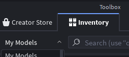

# <span></span> Azul Companion Plugin

## Installation

### Method 1: Automatic via Roblox Marketplace (Recommended)

1. Install the plugin automatically using the Roblox Plugin Marketplace: https://create.roblox.com/store/asset/79510309341601/Azul-Companion-Plugin

> If the plugin does not show up, follow the [troubleshooting steps](#troubleshooting).

### Method 2: Build via Azul (for contributors)

You can use Azul to build the plugin directly from source code:

```ps1
# Move into the plugin directory
cd plugin

# Build the plugin using the generated sourcemap
azul build --from-sourcemap .\plugin.sourcemap.json
```

> [!NOTE]
> You must have **the plugin itself already installed** in Studio for this option to work.
>
> This is planned to change soon by allowing Azul to generate Model files (`rbxm`) directly.

Please note that the dependencies already come bundled with the Plugin (`sync/ReplicatedFirst/AzulCompanionPlugin/Packages`). If you wish to modify them, you'll need to manually install the dependencies in your local plugin folder and push the changes back:

```ps1
# Install dependencies
rokit install
lpm install

# After modifying dependencies, push the changes to the plugin
azul push -s .\Packages\roblox -d ReplicatedFirst.AzulCompanionPlugin.Packages --rojo --destructive

# If you have modified the properties, added, renamed, moved or deleted any scripts, you will need to pack them into a new sourcemap
azul pack -o .\plugin.sourcemap.json

# To older contributors: Generating package types is no longer necessary! LPM already takes care of it for you.
```

## Troubleshooting

### Plugin not showing up

Roblox is very particular about how plugins are installed. "Getting" the plugin from the marketplace isn't enough, you must install it from your **Inventory**:

1. Restart Roblox Studio
2. Open any game (or create a new one)
3. Go to **Toolbox** > **Inventory**<br/>
   
4. In the dropdown, select **My Plugins**
5. Locate the Azul Companion Plugin and click **Install**
6. The Azul icon should now appear in the toolbar

### Plugin not connecting

- Ensure the daemon is running (run `azul`)
- Verify firewall isn't blocking port `8080`

### Scripts not syncing

- In the Plugin, scroll down and click on "Reload Sourcemap"
- Try reconnecting both the plugin and the daemon
- Check for any errors in the daemon console and plugin output window
